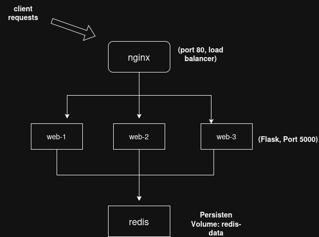
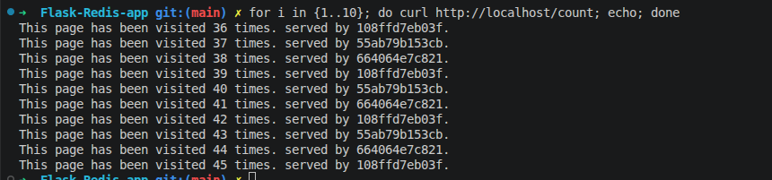

# Flask + Redis + Docker Compose: Persistence, Config & Load Balancing

This is a small containerized web app used as a learning project to practice core
cloud/infra concepts: persistent storage, externalized configuration,
horizontal scaling, and load balancing — all with Docker Compose.

---

## Architecture



---

## Objectives

This project was built incrementally, each stage building on the last:

- [x] Containerize a Flask app with a Redis-backed visit counter
- [x] Add persistent storage for Redis via a Docker volume
- [x] Externalize Redis connection config via environment variables
- [x] Scale the Flask service to multiple instances
- [x] Load balance across instances using nginx

---

## 1. Containerizing the Base App

The starting point was a simple Flask app with two routes: a welcome
page, and a `/count` page that uses Redis to track and display the
number of visits. This was containerized with a `Dockerfile` for the
Flask app, and a `docker-compose.yml` bringing up both the app and a
Redis container together on a shared network.


At this stage, Flask reaches Redis using the Redis container's compose
service name as the hostname (e.g. `redis_host`) — Docker Compose's
built-in DNS resolves service names to the right container
automatically, without needing to know its IP address.

**Verification performed:** built and ran the stack, confirmed the
welcome page loaded and `/count` incremented on each visit.

---
app.py` is a small Flask application with two routes:

- **`/`** — a welcome page.
- **`/count`** — increments a counter stored in Redis (`r.incr('visits')`) and displays how many time the page has been visited

The app connects to Redis using the `redis` Python client:

```python
redis = redis.Redis(host=HOST, port=REDIS_PORT)
```

It's served with `app.run(host='0.0.0.0', port=5000)` rather than the Flask default. This matters in a containerized setup, binding to `0.0.0.0` is an ip address that listens on all addresses. Binding to `127.0.0.1` would have made the app only reachable from inside its own container, causing every proxied request from Nginx to fail.

### The Dockerfiles

**`app/Dockerfile`** builds the Flask service:
- Starts from a `python:3.10-slim` base image.
- Sets a working directory, copies in `requirements.txt` first and installs dependencies, then copies in the rest of the app code. Installing dependencies before copying the full codebase takes advantage of Docker's layer caching, as long as `requirements.txt` doesn't change, Docker reuses the cached dependency install layer on rebuilds instead of reinstalling everything from scratch.
- Runs `app.py` as the container's entrypoint.

### Docker Compose

`docker-compose.yml` ties the services together:

- **`web`** builds from `./app`, depends on `redis` (via `depends_on`) so Redis starts first, and reaches Redis simply by using the service name `redis` as the hostname — Compose runs its own internal DNS, so container names resolve automatically without needing to know or hardcode IP addresses.
- **`redis`** builds from `./redis`, and only `expose`s port 6379 internally rather than mapping it to the host — since nothing outside the Docker network needs to talk to Redis directly, this keeps it unreachable from outside the containers, which is the safer default.

With the base app running, the following improvements were added
incrementally on top of it.

## 2. Persistent Redis Storage

Redis writes its data to `/data` inside its container by default. Without
a volume, that data lives only in the container's writable layer and is
lost on removal/restart. A named Docker volume was added to persist it
across container lifecycles.

**Relevant compose snippet:**

```yaml
 redis_host:
     image: "redis:latest"
     volumes:
     - redis-data:/data
volumes:
   redis-data:
      driver: local
```

**Verification performed:**

1. Started the stack, visited `/count` several times to increment the counter.
2. Ran `docker compose down` (container removed, volume persists).
3. Ran `docker compose up` again.
4. Confirmed `/count` continued from the previous value instead of resetting.

---

## 3. Environment-Variable Configuration

Redis connection details (`REDIS_HOST`, `REDIS_PORT`) are read from
environment variables in the Flask app rather than hardcoded, with
sensible defaults as a fallback.

**Flask (`app.py`):**

```python
[redis_host = os.environ.get('REDIS_HOST', 'redis')
redis_port = int(os.environ.get('REDIS_PORT', 6379))
r = redis.Redis(host=redis_host, port=redis_port,)
```

**Compose (`docker-compose.yml`):**

```yaml
 environment:
      - REDIS_HOST=redis_host
      - REDIS_PORT=6379
```

This seperates redis from being hardcoded to a specific Host allowing it to be run from anywhere. This is standard practice so the code can remain unchanged while moving between different environments.

> *next step: the Redis port is still passed as a
> hardcoded literal in compose rather than pulled from a `.env` file
> with variable substitution. Left as a deliberate scope decision for
> this stage

---

## 4. Scaling the Flask Service

Docker Compose can run multiple instances of a service with
`--scale`. This required removing the fixed host-side port mapping
(`"5000:5000"` → `"5000"`), since multiple containers can't all bind
the same host port simultaneously.

**Command used:**

```bash
docker compose up --scale web=3
```

**Verification performed:**

```


```

Redis was deliberately **not** scaled — all Flask replicas share a
single Redis instance so the visit counter stays consistent regardless
of which replica handles a given request.

---

## 5. Load Balancing with nginx

nginx was added in front of the scaled Flask replicas as a reverse
proxy, distributing incoming requests across all running instances
as simply removing the host side port mapping was not sufficient to
distribute the requests.

**nginx config (`nginx.conf`):**

```nginx
events {}

http {
    upstream flask-app {
        server web:5000;
    }

    server {
        listen 80;

        location / {
            proxy_pass http://flask-app;
        }
    }
}
```

**Compose snippet:**

```yaml
nginx:
    image: nginx:latest
    volumes:
      - ./nginx.conf:/etc/nginx/nginx.conf
    depends_on:
      - web
    ports:
      - 80:80
```

`web` no longer needs to publish a port to the host at all —
only `nginx` does, since it's now the single entry point.

### Load Balancing Verification

To confirm nginx was actually distributing traffic (not just proxying
to a single backend by chance), `socket.gethostname()` was added to the
`/count` response so each reply identifies which container served it:

```python
return f"This page has been visited {count} times. served by {socket.gethostname()}."

```

With 3 replicas running, I ran a simple bash script to show that multiple hosts
are picking up the requests:

```bash
for i in {1..10}; do curl http://localhost/count; echo; done
```

**Output:**

```


```

The differing hostnames across requests confirm nginx's is spreading load across all three `web`
containers, while the visit count increments consistently — confirming
the shared Redis backend correctly centralises state across replicas.

---

## Project Structure

```

.
├── count.py
├── Dockerfile
├── docker-compose.yml
├── nginx.conf
└── README.md
```

---

## Running It Yourself

```bash
git clone [your repo URL]
cd [repo name]
docker compose up --build --scale web=3
```

Then visit **http://localhost/count** and refresh a few times.

---

## Future Improvements

Deliberate scope decisions / things identified but not (yet) implemented:

- **Full `.env` + variable substitution** in compose so the Redis port
  isn't duplicated as a literal in two places.
- **Templated HTML** (`render_template` + `templates/`) instead of raw
  returned strings, once personalising the welcome page.
- **Redis exposure** — currently `redis_host` publishes `6379` to the
  host machine as well as the internal network; not required now that
  `web` reaches it via the service name, and worth removing to reduce
  surface area.

---

## What I Learned

Coming from an It support background, most of my prior exposure has been reactive, 
not having actually built the infrastructure i deal with day to day, 
this project gave me an understanding of what goes on in the background and 
it was very fun to actually design and implement the general structure of albeit small web app

I had alot of fun doing this project. It taught me why Docker is so valuable to modern infrastructure 
and how containerization solves the industry problem of "It only works on my Machine".

By implementing environment variables it removed some of the details that were hard coded such as the 
Redis connection. This is relevant as it allows the code to be reactive to environment changes and run comfortable
from a local machine, to an on premise server or even on cloud infrastructure.

Scaling and load balancing are very different. I had a bit of trouble when scaling this application as i thought it
was as simple as removing the host port ,running docker compose up --scale and the traffic distribution would handle itself.
This was wrong as it only runs more containers. Understanding that nginx was the piece that would solve this problem was 
critical and seeing it first hand was vital for me to properly understand the difference between scaling and load balancing.

This Project also taught me why its so important to constantly test and verify your application is acting as expected.
More than once i had assumed that my code was working fine or even looked broken but turned out to be the opposite until
I actually tested it.for example Redis persistence looked fine until i deliberately tore the container down.


